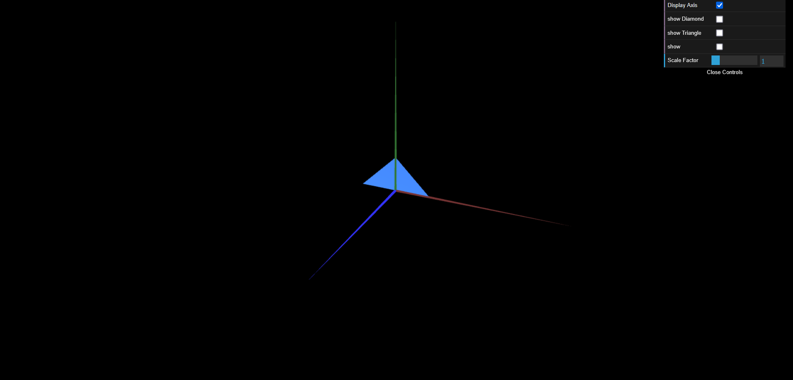
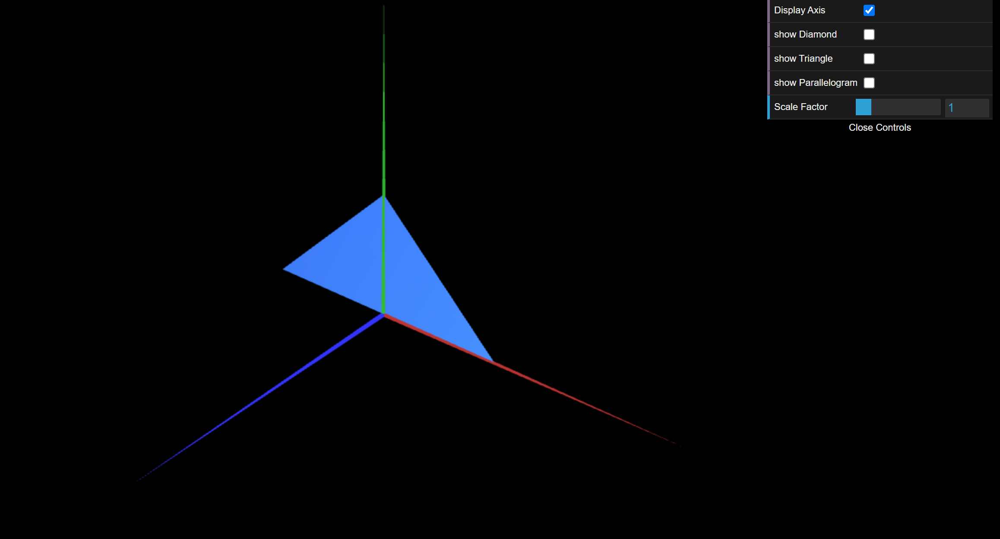

# CG 2024/2025

## Group T05G08

## TP 1 Notes

### Exercise 1
- We observed that for the geometric shapes to be double-sided (visible from both sides), we need to have the indices both in counterclockwise and clockwise directions.

### Exercise 2
- We didn't have any difficulties doing the exercise.

