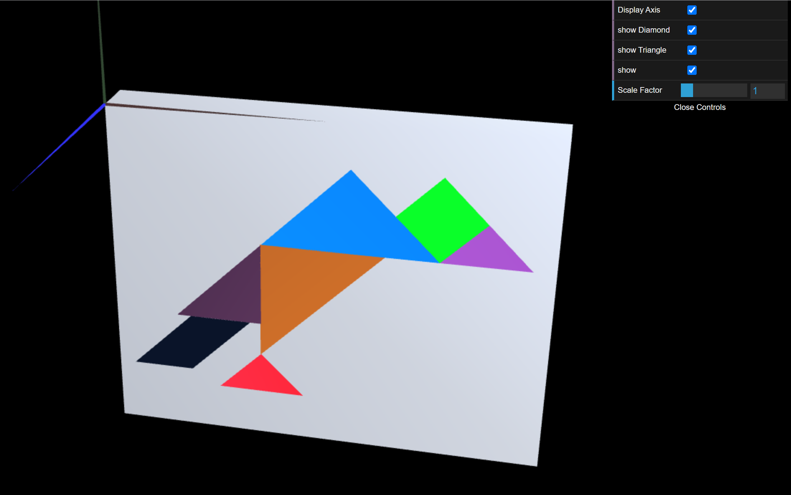
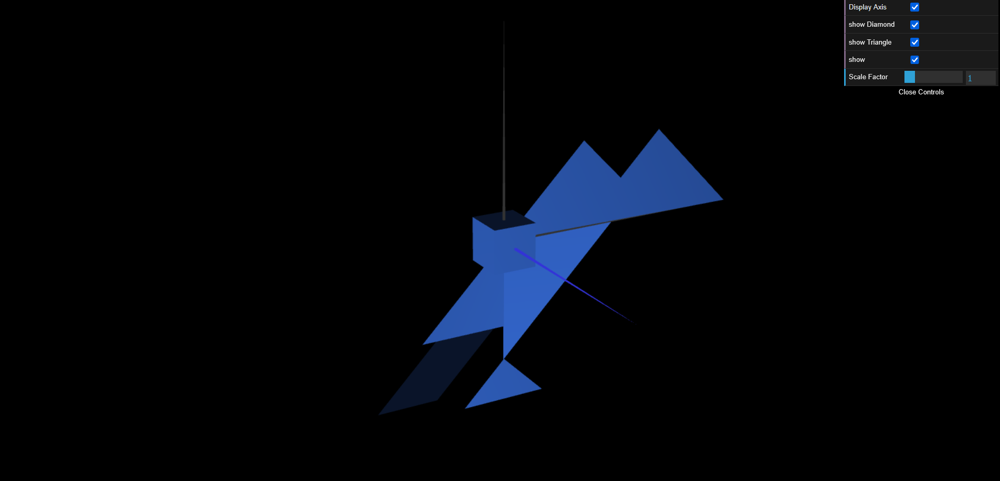

# CG 2024/2025

## Group T05G08

## TP 2 Notes

### Exercise 2
- It was a bit challenging to find the right coordinates of the pieces for the tangram.

### Exercise 3
- We gained a better understanding of the order of translations and their relevance.

### Exercise 4
- We didn't have any difficulties doing this exercise.

