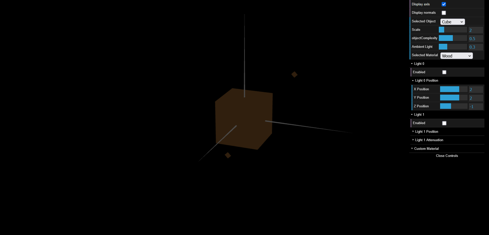
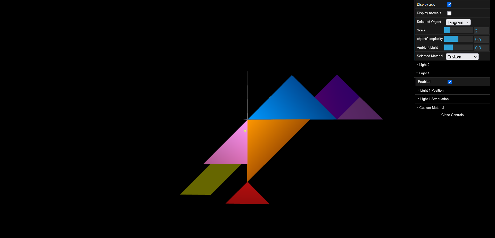
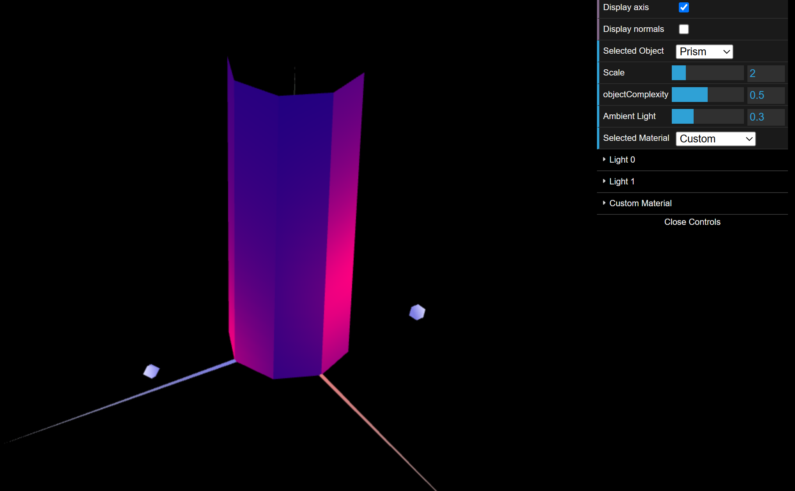
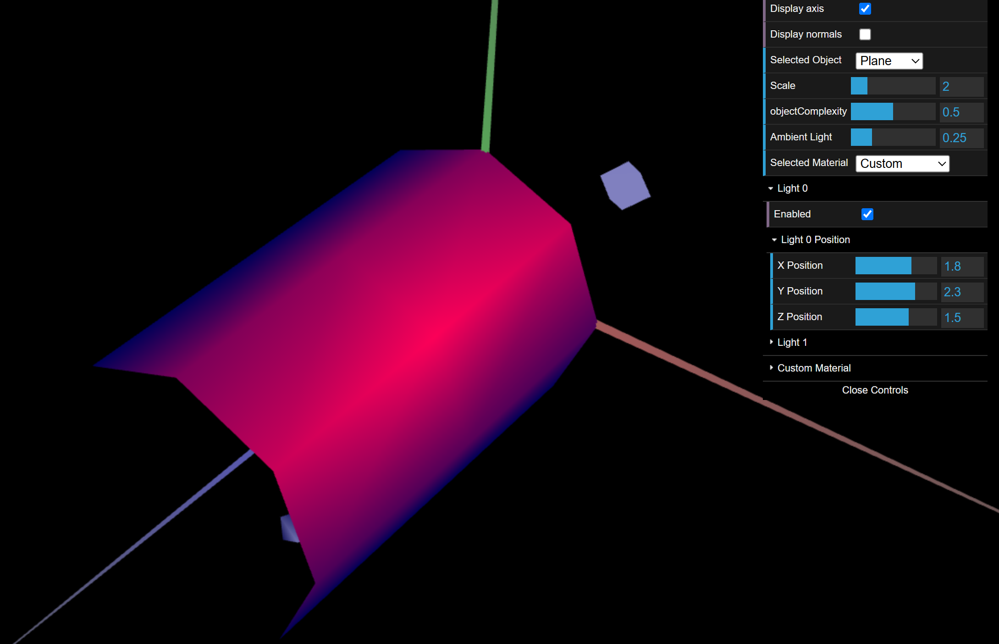

# CG 2024/2025

## Group T05G08

## TP 3 Notes

### Part 1: Tangram Lighting and Materials

### Part 2: Drawing of a prism
- With normals perpendicular to each face, the lighting remains uniform within each surface and creates sharp transitions between adjacent faces. This is similar to "Constant Shading", where each face receives a single lighting value without smooth interpolation. As a result, the prism appears faceted with clearly defined edges, unlike techniques like Gouraud that produce smoother transitions between faces.

### Part 3: Cylindrical Surface - Application of Gouraud shading

